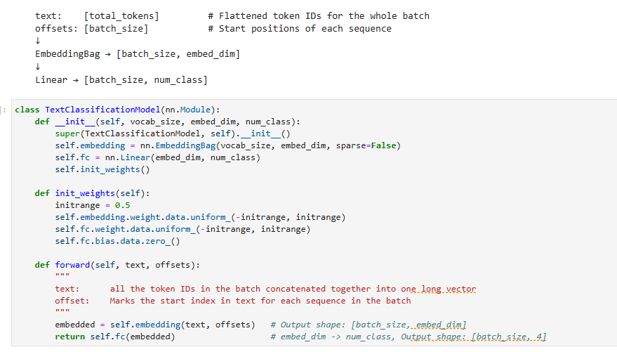
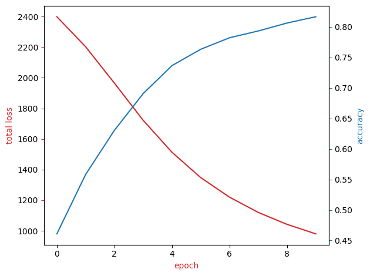

# News Article Classification with PyTorch & TorchText


An end-to-end Natural Language Processing project to classify news articles into four categories (World, Sports, Business, Sci/Tech) using a classic neural network architecture built with PyTorch. This project demonstrates a full pipeline from data preprocessing and vocabulary creation to model training, evaluation, and visualization.

---

## Project Overview

Imagine a news organization with a massive, unorganized digital archive. Manually sorting thousands of articles is impossible. This project solves that problem by building an automated system that reads an article and assigns it to the correct category. The goal is to create a robust classification model that can be used to power a search engine, organize content, and improve user experience.

### ✨ Key Features

* **End-to-End NLP Pipeline:** Complete workflow from raw text to final prediction.
* **Efficient Text Representation:** Utilizes PyTorch's `EmbeddingBag` for fast and effective text-to-vector conversion.
* **High Accuracy:** Achieves **~81.4% accuracy** on the AG News test dataset.
* **Rich Visualization:** Includes t-SNE plots to visualize how the model learns to group similar articles.

---

## 🧠 Model Architecture

The core of this project is a simple yet effective neural network. It uses an `EmbeddingBag` layer, which is highly efficient for text classification. Unlike a standard `Embedding` layer that produces a sequence of vectors, `EmbeddingBag` computes an average or sum of all word embeddings in a text, outputting a single vector per document. This single vector then passes through a fully-connected linear layer to produce the final category predictions.

This architecture is defined in the `TextClassificationModel` class:



---

## Results & Evaluation

The model was trained for 10 epochs, demonstrating strong learning capabilities and stable performance.

### Training Performance

The training process shows a clear trend of decreasing loss and increasing validation accuracy, indicating that the model learned effectively without overfitting.



### Final Accuracy

| Dataset     | Accuracy |
| :---------- | :------: |
| Validation  |  81.7%   |
| **Test** | **81.4%**|

### Embedding Visualization with t-SNE

To understand *what* the model learned, we can visualize the high-dimensional embedding vectors in 3D using t-SNE. Each point represents a news article, colored by its true category. The clear clustering shows that the model has successfully learned to map articles with similar topics to nearby points in the vector space.

* **Blue:** World
* **Green:** Sports
* **Yellow:** Business
* **Purple:** Sci/Tech


---

## Directory Structure
The repository is organized as follows:

```
document-classification-nlp/
├── doc_classification.ipynb    # Main notebook with all the code
├── my_model.pth                # Saved state of the trained model weights
├── images/                     # Folder for storing plots and visuals
│   ├── article_clf_results.png # Sample of classification results
│   ├── embd_visual_1.png       # t-SNE embedding visualization
│   ├── loss_acc_plot.png       # Training loss and accuracy plot
│   └── model_arch_code.png     # Screenshot of the model's code
└── README.md
```

---
